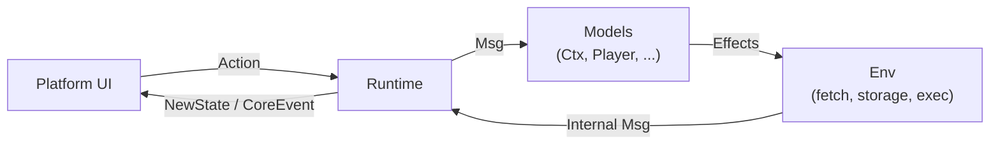

<div align="center">


# stremio-core

**The Rust engine that powers every Stremio app.**

[](https://github.com/Stremio/stremio-core/actions/workflows/build.yml)
[](https://github.com/Stremio/stremio-core/actions/workflows/msrv.yml)
[](https://stremio.github.io/stremio-core)
[](/LICENSE.md)

**[📚 API Docs](https://stremio.github.io/stremio-core)** · [Website](https://www.stremio.com) · [Report a bug](https://github.com/Stremio/stremio-core/issues)

</div>

[Stremio](https://www.stremio.com) is a modern media center — a one-stop solution for discovering, organizing and streaming video content via addons. `stremio-core` is the single Rust codebase that contains all the logic shared between Stremio apps: user/addon state, the addon protocol, library, notifications, playback state and deep links. The UIs are thin layers on top — this crate is the app.

### Goals

- **Flexibility** — integrates into any codebase, across the entire stack and in different paradigms: `types` alone can be used by addons, or the full `Ctx` model can be the backbone of a whole Stremio app
- **Emphasis on correctness**
- **No cruft / legacy** — not burdened by obsolete decisions and solutions

## 🧠 Architecture

The state management is inspired by [the Elm Architecture](https://guide.elm-lang.org/architecture/): state flows in one direction, side effects are explicit, and the platform is abstracted away behind a trait.



1. The UI dispatches an [`Action`](/src/runtime/msg/action.rs) to the [`Runtime`](/src/runtime/runtime.rs).
2. The `Runtime` routes it as a [`Msg`](/src/runtime/msg/msg.rs) to the state models, which update themselves and return [`Effects`](/src/runtime/effects.rs) — explicit descriptions of side effects (futures) to run.
3. Effects execute through the [`Env`](/src/runtime/env.rs) trait and resolve back into the loop as `Internal` messages.
4. Changed models are announced to the UI as `NewState`; noteworthy happenings are emitted as [`Event`](/src/runtime/msg/event.rs)s.

Each platform only has to implement `Env` — HTTP fetch, storage, task execution and time — and compose its own model out of the building blocks with [`#[derive(Model)]`](/stremio-derive/src/lib.rs).

## 📦 What's inside

| Module / crate | What it is |
|---|---|
| [`src/types`](/src/types) | The vocabulary: addon manifests and resources, meta items, streams, subtitles, library, profile, API types |
| [`src/models`](/src/models) | The state models: [`Ctx`](/src/models/ctx) (profile, library, notifications — the backbone), `CatalogWithFilters`, `MetaDetails`, `Player`, `LibraryWithFilters`, `StreamingServer`, `Calendar` and more |
| [`src/runtime`](/src/runtime) | The reactive engine: `Runtime`, `Effects`, `Env`, messages |
| [`src/addon_transport`](/src/addon_transport) | Addon protocol client — modern HTTP(S) JSON plus a legacy JSON-RPC adapter |
| [`src/deep_links`](/src/deep_links) | Deep link generation for every platform |
| [`stremio-core-web/`](/stremio-core-web) | WASM bridge published to npm as [`@stremio/stremio-core-web`](https://www.npmjs.com/package/@stremio/stremio-core-web) — runs core in a Web Worker for [stremio-web](https://github.com/Stremio/stremio-web) |
| [`stremio-derive/`](/stremio-derive) | `#[derive(Model)]` proc macro |
| [`stremio-watched-bitfield/`](/stremio-watched-bitfield) | Compact encoding of per-video watched state |

### Feature flags

| Feature | Effect |
|---|---|
| `derive` | Re-exports `#[derive(Model)]` from `stremio-derive` |
| `analytics` | Enables the analytics module |
| `env-future-send` | Adds `Send` bounds to `Env` futures (incompatible with the WASM target) |
| `deflate` | Forwards to `stremio-official-addons/deflate` |

## 🚀 Development

You'll need Rust 1.77 or newer (MSRV, checked in CI).

```bash
cargo fmt --all -- --check
cargo clippy --all --no-deps -- -D warnings
cargo test
cargo build
```

Docs are built with the nightly toolchain pinned in [`docs.yml`](/.github/workflows/docs.yml):

```bash
RUSTDOCFLAGS="--cfg docsrs -Z unstable-options --enable-index-page" cargo +nightly build-docs
```

For the WASM bridge, see [`stremio-core-web/README.md`](/stremio-core-web/README.md).

### Tips

- New actions are defined in [`src/runtime/msg/action.rs`](/src/runtime/msg/action.rs) — the message enums there are the public API surface of the crate.
- WASM output can get large, especially when deriving `Serialize`/`Deserialize` where it isn't needed. Run `twiggy top ..._bg.wasm` to find the biggest code size offenders.

## 🧩 Ecosystem

| Repository | What it is |
|---|---|
| [stremio-web](https://github.com/Stremio/stremio-web) | The web UI, driven by this crate through `stremio-core-web` |
| [stremio-core-kotlin](https://github.com/Stremio/stremio-core-kotlin) | Kotlin/JNI bindings for Android (archived) |
| [stremio-addon-sdk](https://github.com/Stremio/stremio-addon-sdk) | Build your own addon in Node.js |
| [local-search](https://github.com/Stremio/local-search) | Search suggestions engine used by the `LocalSearch` model |

## 📄 License

Copyright © 2019-2026 Smart Code OOD. Released under the MIT license — see [LICENSE](/LICENSE.md).
